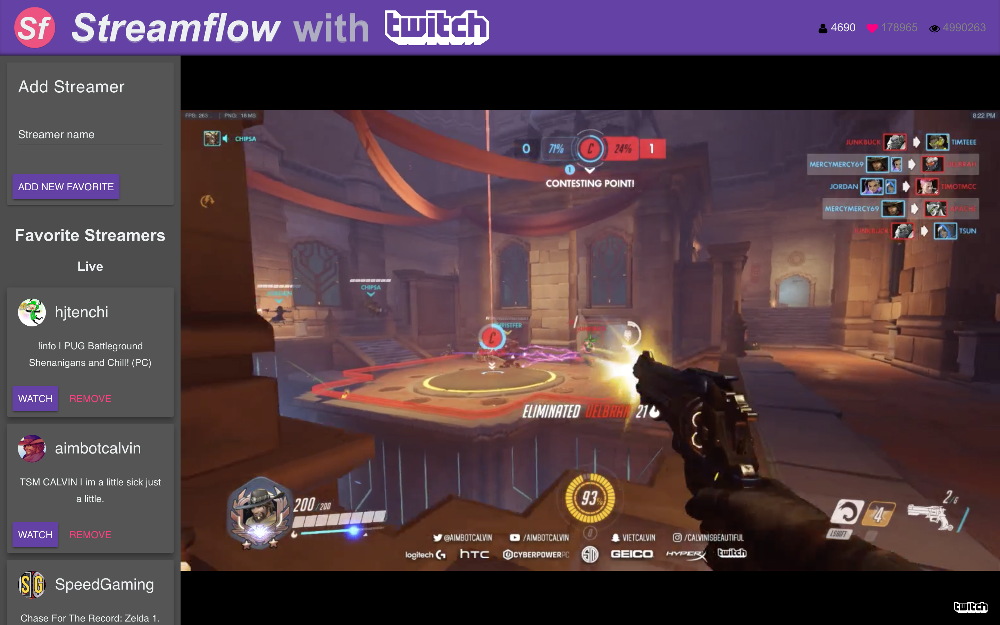

#  Streamflow

Streamflow is an [Electron](https://electron.atom.io/)-powered desktop application for watching your favorite Twitch streamers without any downtime.

> Note: *Streamflow is not affiliated with Twitch.* This is a third-party hobby project. For questions, contact the repository owner, not Twitch.

In other words, Streamflow automatically shifts to your next favorite online streamer when the one you're watching goes offline. Perfect for putting on in the background for long study sessions or chores.

No logins, no bullshit. Just open the app and get back to your day.

## Features

- Flow from one favorite streamer to the next
- Easily manage favorite streamers from in app
- Persistent settings
- Sleek material design interface
- *Semi*-response layout

## Config

While you should never have to edit this file yourself (and be **very** careful if you should), all settings are saved to `~/.streamflow.json`.

At the moment, this is just an array of the names of your favorite streamers.

## Supported platforms

- MacOS (Tested MacOS Sierra 10.12.5)
- Windows (Tested Windows 10)
- Linux (not yet tested)

## Package from source

Clone the repository and run this command to build both the electron app and package it: `yarn run package` or `npm run package`.
